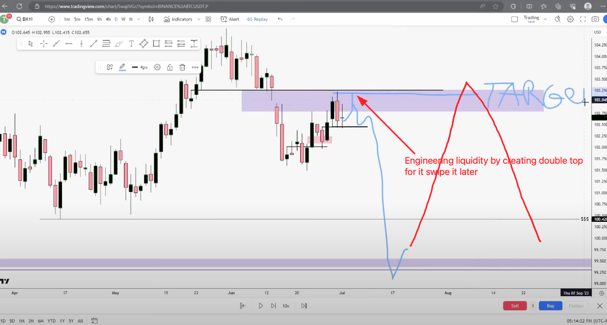

# 1⃣ Part 1

Market controller → Bitcoin, ES1! (or NQ1!), DXY, Gold, Crude Oil, EURUSD, ZB1!&#x20;

Where is the next draw on the liquidity? Where we are going and why we are going?

### Sometimes price doesn't fully retrace

<figure><figcaption></figcaption></figure>

### Liquidity void / Volume Imbalance

<figure><figcaption></figcaption></figure>

### FVG becomes IFVG

<figure><figcaption></figcaption></figure>

### Possible draw on Internal liquidity

Multiple possible draw on internal liquidity inside htf fvg

<figure><figcaption></figcaption></figure>

### Engineering liquidity to swipe it later

MMs need to create liquidity for exit of longs from below

<figure><figcaption></figcaption></figure>

### Youtube


